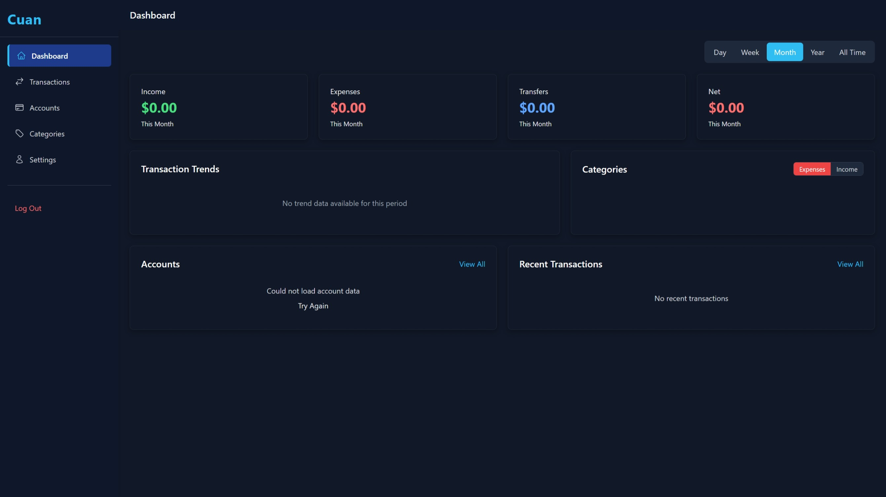

# Cuan - Aplikasi Manajemen Keuangan Personal



**Cuan** adalah aplikasi manajemen keuangan personal yang memudahkan pengelolaan keuangan Anda. Aplikasi ini membantu Anda mencatat dan memantau pengeluaran, pemasukan, serta transfer antar rekening dalam antarmuka yang intuitif dan modern.

> **Cuan**: Catat Uang, Analisis, Nikmati!

## Fitur Utama

- **Dashboard** - Visualisasi dan ringkasan keuangan dengan grafik interaktif
- **Transaksi** - Pencatatan pemasukan, pengeluaran, dan transfer antar rekening
- **Kategori** - Pengelolaan kategori transaksi untuk pemasukan dan pengeluaran
- **Akun** - Manajemen berbagai jenis rekening keuangan
- **Laporan** - Analisis keuangan dengan berbagai filter dan periode
- **Responsif** - Antarmuka yang optimal untuk desktop dan seluler

## Teknologi

- **Frontend**: React, TypeScript, Tailwind CSS
- **State Management**: React Hooks
- **Routing**: React Router
- **Visualisasi**: Chart.js
- **UI Components**: Headless UI, Heroicons
- **Toast Notifications**: React Hot Toast

## Instalasi

```bash
# Clone repositori
git clone https://github.com/yudopr11/cuan.git

# Masuk ke direktori proyek
cd cuan

# Instal dependensi
npm install

# Jalankan aplikasi dalam mode pengembangan
npm run dev
```

## Struktur Proyek

```
/src
  /components          # Komponen React
    /accounts          # Komponen terkait akun/rekening
    /auth              # Komponen autentikasi
    /categories        # Komponen kategori transaksi
    /common            # Komponen yang digunakan di berbagai tempat
    /dashboard         # Komponen dashboard utama
    /layout            # Layout dan struktur halaman
    /settings          # Komponen pengaturan aplikasi
    /transactions      # Komponen transaksi keuangan
  /hooks               # Custom React hooks
  /services            # Layanan dan utilitas aplikasi
  /utils               # Fungsi utilitas
```

## Keamanan

- Autentikasi user dengan token
- Enkripsi data sensitif
- Validasi input untuk mencegah injeksi

## Pengembangan

### Prasyarat

- Node.js (versi 16.x atau yang lebih baru)
- npm atau yarn

### Menjalankan Tes

```bash
npm test
```

### Build untuk Produksi

```bash
npm run build
```

## Deployment

### Railway

Deploying to Railway is simple:

1. Create an account on [Railway](https://railway.app)
2. Click "New Project" on the Railway dashboard or "New Services" inside Railway Project
3. Select "Deploy from GitHub repo"
4. Choose your cloned repository
5. Railway will automatically detect the Vite configuration and deploy your site

That's it! Railway will automatically build and deploy your application. If needed, you can add environment variables in your project settings.

## Lisensi

This project is licensed under the MIT License - see the [LICENSE](LICENSE) file for details.


## Acknowledgments
- Created by [yudopr](https://github.com/yudopr11)
- Built with [Vite](https://vitejs.dev/), [React](https://reactjs.org/), [TypeScript](https://www.typescriptlang.org/), and [Tailwind CSS](https://tailwindcss.com/)
- Deploy with [Railway](https://railway.app)