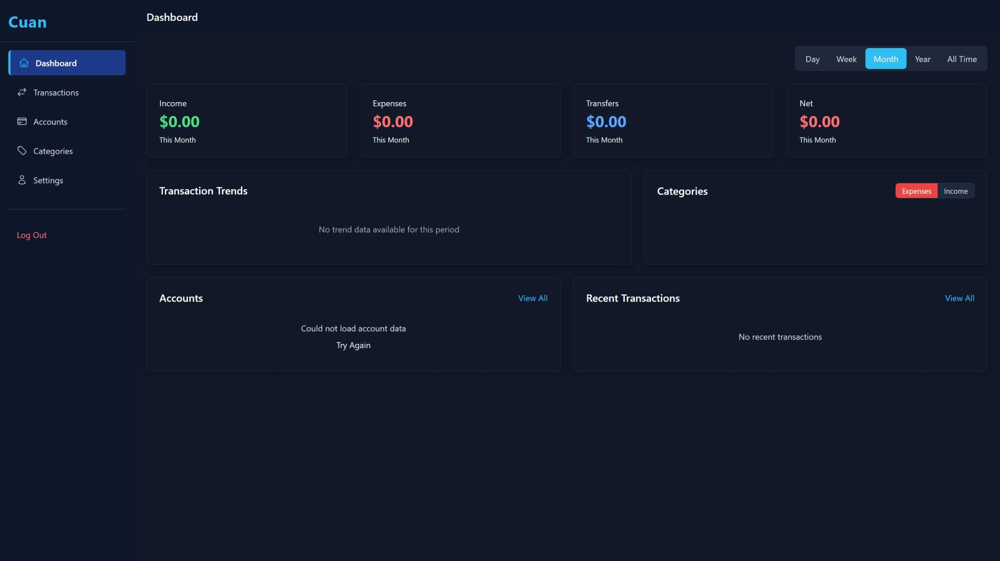

# Cuan - Personal Financial Management Made Easy

Cuan (Catat Uang, Analisis, Nikmati!) is a modern personal financial management application that makes it easy to track and analyze your finances with an intuitive and beautiful interface.



## Features

* 💰 Track income, expenses, and transfers between accounts
* 📊 Interactive dashboard with financial visualizations
* 🗂️ Organize transactions with customizable categories
* 💼 Manage multiple financial accounts in one place
* 📈 Generate detailed financial reports with various filters
* 🔒 Secure user authentication with token-based security
* 🎨 Modern dark-themed UI for reduced eye strain
* 📱 Responsive design for desktop and mobile devices
* 🔄 Progressive Web App (PWA) support for offline access and app-like experience
* 🌏 Timezone-aware date display — all dates shown in your selected timezone while API data stays in UTC

## Tech Stack

* **Frontend Framework**: React with TypeScript
* **Styling**: Tailwind CSS
* **Build Tool**: Vite
* **UI Components**:  
   * Headless UI for accessible components  
   * Heroicons for beautiful icons
* **Visualization**: Chart.js for financial graphs
* **State Management**: React Hooks (custom hooks for currency, timezone, and page title)
* **Routing**: React Router
* **Notifications**: React Hot Toast
* **Timezone Handling**: `Intl.DateTimeFormat` with user-selected timezone; UTC preserved for all API communication
* **PWA Support**:
   * Vite PWA Plugin for full PWA functionality
   * Automatic service worker generation
   * Smart caching strategies
* **Security**:  
   * Token-based authentication  
   * Encryption for sensitive data  
   * Input validation against injection
* **Development Tools**:  
   * ESLint for code quality  
   * TypeScript for type safety  
   * PostCSS for CSS processing

## Settings

Cuan provides a built-in Settings page (available on both desktop and mobile) with the following options:

* **Currency** — Choose how monetary values are displayed (IDR, USD, EUR, GBP, JPY, SGD, MYR). Affects display only; stored values are unchanged.
* **Timezone** — Select your local timezone from a full list of UTC offsets. All dates and times in the UI — transactions, charts, filters, and account year views — are rendered in your selected timezone. Data is always stored and sent to the API as UTC.

## UI Design

Cuan features a modern, intuitive interface with a clean design that makes financial management a pleasant experience. The interface uses a carefully designed color scheme with:

* Dark mode support for reduced eye strain
* Intuitive navigation between different sections
* Interactive charts and visualizations
* Clean, uncluttered transaction views
* Responsive design that works on all devices
* Installable as a PWA on mobile and desktop devices

## Getting Started

1. Clone the repository

```bash
git clone https://github.com/yourusername/cuan.git
cd cuan
```

2. Install dependencies

```bash
npm install
```

3. Set up environment variables (if applicable)

```bash
cp .env.example .env
```

Edit `.env` with your configuration.

4. Start development server

```bash
npm run dev
```

## Building for Production

```bash
npm run build
```

The build output will be in the `dist` directory.

## Progressive Web App (PWA)

Cuan is available as a Progressive Web App, which means you can:

* **Install on your device**: Add it to your home screen on mobile or desktop
* **Work offline**: Continue using the app even without an internet connection
* **Faster loading**: Cached resources for improved performance
* **App-like experience**: Full-screen mode and native-like interface

### Installing Cuan as a PWA

1. On Chrome/Edge (desktop):
   - Click the install icon in the address bar
   - Follow the prompts to install

2. On Safari (iOS):
   - Tap the Share button
   - Select "Add to Home Screen"
   - Follow the prompts to install

3. On Chrome (Android):
   - Tap the menu button (three dots)
   - Select "Add to Home Screen"
   - Follow the prompts to install

### PWA Features

* **Offline Support**: Basic functionality is available even without an internet connection
* **Auto Updates**: The app automatically updates when new versions are available
* **Native Integration**: Access device features and receive notifications (where supported)
* **Lightweight**: Smaller installation footprint than a traditional app

## Security Considerations

1. **Environment Variables**
   - Never commit `.env` file to version control
   - Use different encryption keys for development and production
   - Keep your production encryption key secure

2. **Token Storage**
   - JWT tokens are encrypted using AES before storage in localStorage
   - Tokens are automatically decrypted when making API requests
   - Failed encryption/decryption is logged with fallback behavior
   - Error handling provides security-related feedback without exposing sensitive details

3. **Authentication**
   - Axios interceptors automatically handle authentication and refresh tokens
   - Toast notifications for authentication errors with appropriate error messages
   - Automatic redirection for expired sessions

4. **Data Security**  
   * Encryption of sensitive financial data  
   * Input validation to prevent injection attacks  
   * Secure API communication

## Project Structure

```
cuan/
├── public/               # Static assets
│   ├── icons/            # PWA icons in various sizes
│   └── manifest.json     # PWA manifest file
├── src/                  # Source code
│   ├── components/       # React components
│   │   ├── accounts/     # Account management components
│   │   ├── auth/         # Authentication components
│   │   ├── categories/   # Category management components
│   │   ├── common/       # Shared/common components
│   │   ├── dashboard/    # Dashboard and visualization components
│   │   ├── layout/       # Page layout components
│   │   ├── settings/     # Application settings components (currency, timezone)
│   │   └── transactions/ # Transaction management components
│   ├── hooks/            # Custom React hooks
│   │   ├── useCurrencyFormatter.ts  # Currency display formatting
│   │   ├── useTimezone.ts           # Timezone-aware date formatting
│   │   └── usePageTitle.ts          # Page title management
│   ├── services/         # API and services
│   ├── utils/            # Utility functions
│   │   └── settingsOptions.ts       # Shared currency and timezone option lists
│   ├── App.tsx           # Main application component
│   └── main.tsx          # Application entry point with PWA registration
├── index.html            # HTML entry point
├── package.json          # Project dependencies and scripts
├── tailwind.config.js    # Tailwind CSS configuration
├── tsconfig.json         # TypeScript configuration
└── vite.config.ts        # Vite configuration with PWA settings
```

## Deployment

### Railway

Deploying to Railway is simple:

1. Create an account on [Railway](https://railway.app)
2. Click "New Project" on the Railway dashboard or "New Services" inside Railway Project
3. Select "Deploy from GitHub repo"
4. Choose your cloned repository
5. Railway will automatically detect the Vite configuration and deploy your site

That's it! Railway will automatically build and deploy your application. If needed, you can add environment variables in your project settings.

## License

This project is licensed under the MIT License - see the [LICENSE](LICENSE) file for details.

## Acknowledgments

* Created by [yudopr](https://github.com/yudopr11)
* Built with [Vite](https://vitejs.dev/), [React](https://reactjs.org/), [TypeScript](https://www.typescriptlang.org/), and [Tailwind CSS](https://tailwindcss.com/)
* PWA support via [vite-plugin-pwa](https://vite-pwa-org.netlify.app/)
* Deploy with [Railway](https://railway.app)